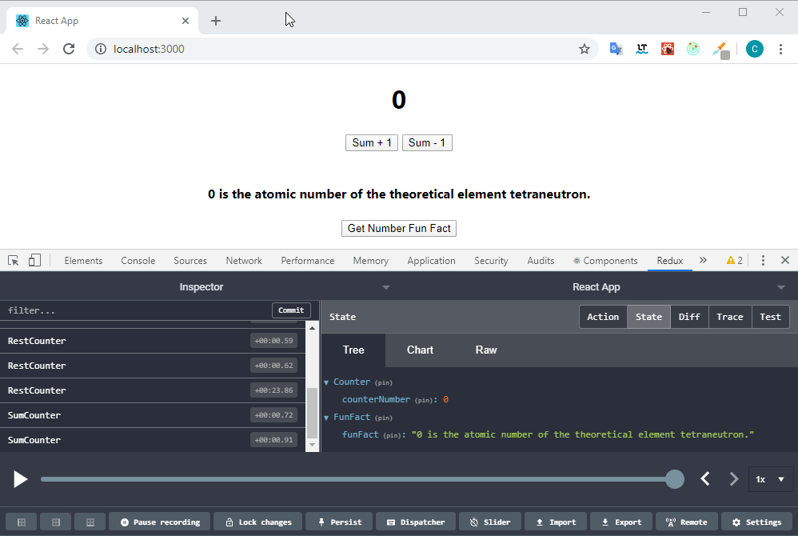

# Recipe for Redux with Typescript Thunk and Hooks

After a lot of research and refactoring, I manage to reduce a lot of verbose in my React apps. 
I couldn't find a recipe online for Redux, Thunk, Typescript and Hooks. 
Hence, I want to share what I did.

For explanation, check my [Medium story](https://medium.com/@christianjocker/recipe-for-redux-with-typescript-thunk-and-hooks-f16bd7e845fe) or [YouTube Video](https://www.youtube.com/watch?v=DAv_GWLRlgg)

Checkout an even better verion with Redux toolkit [here](https://github.com/cjoecker/counter-reduxtoolkit-example)
